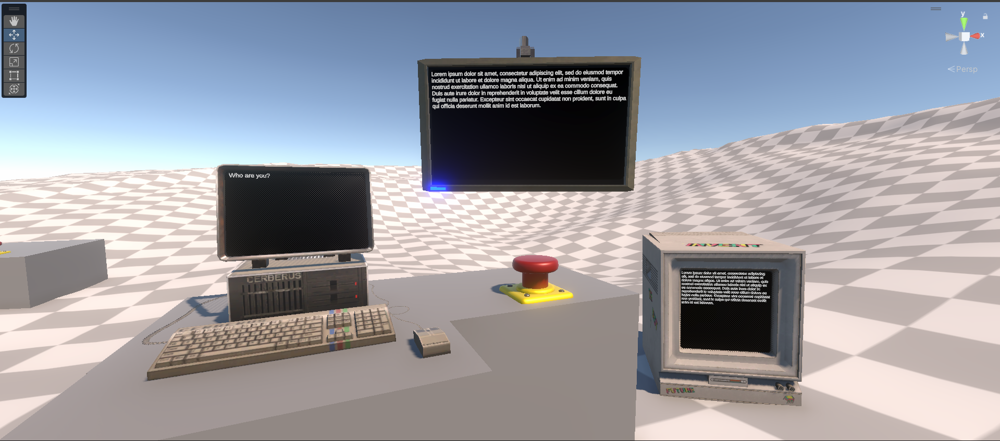
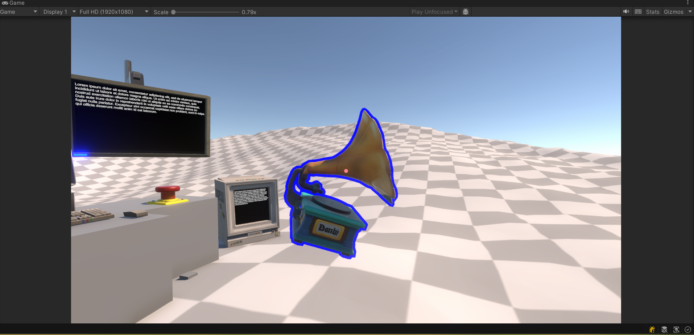
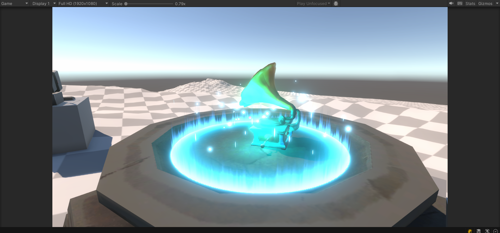

# AI_Talker
Prototype of a 3D puzzle game with AI-driven interactions.  
Features include:  
- Integration with Google Gemini LLM for dynamic NPC dialogues
([Features Demo 1](https://youtu.be/Fayz5owudAU))
- Real-time voice synthesis with ElevenLabs API  
- Basic third-person character controller (movement, camera)  
- Object interaction mechanics and simple animation triggers

- ScriptableObject-driven system with a unique description for each object. This allows the LLM model to describe any item in real time and communicate with the player about it.
([Features Demo 2](https://youtu.be/KauKoP397Vk))

⚠️ Project is an early prototype.  
